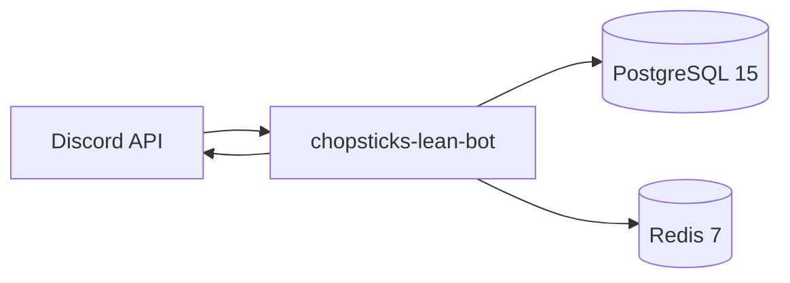

<div align="center">

# Chopsticks Lean

**A self-hosted Discord bot for moderation, economy, voice rooms, and community tools.**


</div>

---

The Discord bot running the [Mad House](https://madebymadhouse.cloud) community server.

This is a lean build of [Chopsticks](https://github.com/samhcharles/chopsticks) — the full-featured open-source Discord bot also built by Mad House. Lean means one process, one VPS, no dashboard, no agents, no music stack. Everything a growing community needs, nothing it doesn't.

---

## Quickest Setup — Let an AI Do It

Copy the prompt below into [Claude Code](https://claude.ai/code), Cursor, or any AI coding assistant. It'll walk you through the entire process — you just answer its questions.

```
I want to self-host the Chopsticks Lean Discord bot for my Discord server.
The repo is at https://github.com/samhcharles/chopsticks-lean

Please help me:
1. Clone the repo and review what it does
2. Create a Discord bot application at discord.com/developers and walk me through getting my token and client ID
3. Fill in the .env file with all required values
4. Start the bot using Docker Compose
5. Deploy the slash commands to my Discord server
6. Verify the bot is online and working

I have a Linux VPS with Docker and Docker Compose installed.
Walk me through each step one at a time.
```

The whole process takes under 15 minutes.

---

## What's Included

| | |
|---|---|
| 🛡️ **Moderation** | Warn, timeout, kick, ban, purge, mod logs, antispam, automod, verification gate |
| 🎫 **Tickets** | Private channels, transcripts on close, auto-close, support crosspost |
| 🔊 **Voice Rooms** | Lobby-based temp rooms, per-room control panel, auto-delete |
| ⭐ **Leveling / Creds** | Activity-based system, rank cards, leaderboard, level roles |
| 💰 **Economy** | Balance, daily, work, gather, pay |
| 📅 **Scheduled Messages** | Water reminders, custom polls, DM broadcasts |
| 🔧 **Server Tools** | Welcome/rules/FAQ posts with SVG banners, reaction roles, reminders, starboard, suggestions |
| 📢 **DM Updates** | Role-gated broadcast system with member opt-in/out |

---

## What's Stripped (vs full Chopsticks)

| Removed | Reason |
|---|---|
| Music / Lavalink | Not needed for most communities |
| AI agents | Lives in the full stack |
| Web dashboard | Reduces complexity and VPS cost |
| Multi-service voice | Overkill for lean deployments |
| Trading cards, casino, pets, trivia | Full Chopsticks only |

---

## Requirements

```
Node.js 22+
PostgreSQL 15+
Redis 7+
Docker + Docker Compose (recommended)
A Discord bot application — discord.com/developers
```

---

## Manual Setup

**1. Create your Discord bot**

Go to [discord.com/developers](https://discord.com/developers/applications), create a new application, add a bot, and copy the token. Enable under the Bot tab:
- Server Members Intent
- Message Content Intent

**2. Clone and configure**

```bash
git clone https://github.com/samhcharles/chopsticks-lean.git
cd chopsticks-lean
cp .env.example .env
```

Open `.env` and fill in at minimum:

```bash
DISCORD_TOKEN=your_bot_token
CLIENT_ID=your_application_id
DEV_GUILD_ID=your_server_id
BOT_OWNER_IDS=your_discord_user_id
```

**3. Start with Docker Compose**

```bash
docker compose up -d --build
```

This starts the bot, Postgres, and Redis together. Data persists in Docker volumes.

**4. Deploy slash commands**

```bash
docker compose exec bot npm run deploy:guild
```

> [!NOTE]
> Run this once after first boot, and again any time you add or change slash commands.
> Use `deploy:global` for production-wide deployment (takes up to 1 hour to propagate).

**5. Invite the bot**

Go to OAuth2 → URL Generator in the developer portal. Select `bot` and `applications.commands` scopes, then add permissions: Manage Channels, Manage Roles, Send Messages, Embed Links, Read Message History.

---

## Key Environment Variables

| Variable | Required | Description |
|---|---|---|
| `DISCORD_TOKEN` | Yes | Bot token from Discord developer portal |
| `CLIENT_ID` | Yes | Application ID from Discord developer portal |
| `DEV_GUILD_ID` | Yes | Your server ID — used for slash command deployment |
| `POSTGRES_URL` | Yes | PostgreSQL connection string |
| `REDIS_URL` | Yes | Redis connection string |
| `BOT_OWNER_IDS` | Yes | Your Discord user ID (comma-separated for multiple) |
| `BANNER_URL` | No | Image URL shown in welcome and rules embeds |
| `COLOR_PRIMARY` | No | Primary embed color as a hex integer (default: `0xCC3300`) |
| `BOT_SERVER_NAME` | No | Your server's name for bot copy (default: `Your Server`) |
| `BOT_HUB_URL` | No | Link shown in welcome embed hub button |
| `BOT_GITHUB_URL` | No | Link shown in welcome embed GitHub button |
| `BOT_WEBSITE_URL` | No | Link shown in welcome embed website button |

See [.env.example](./.env.example) for the full list.

---

## Project Layout

```
src/
  commands/        Slash commands
  events/          Discord event handlers
  prefix/          Prefix command router and commands
  tools/voice/     Voice room logic (lobby, custom VC, panel)
  utils/           Shared runtime utilities
  config/          Branding and feature flags
  game/            Leveling, economy, render (rank cards, SVG banners)
migrations/        PostgreSQL schema migrations
scripts/           Slash command deploy and ops helpers
docker-compose.yml Bot + Postgres + Redis
```

---

## Running Without Docker

```bash
npm ci
npm run migrate
npm run deploy:guild
node src/index.js
```

For process management, use `pm2` or a `systemd` unit. The bot is a single process.

---

## Architecture



---

## Origin

Chopsticks Lean is derived from [Chopsticks](https://github.com/samhcharles/chopsticks), the full-featured open-source Discord bot built by Mad House. The lean build exists because the Mad House server doesn't need every feature — and running lean means fewer things to maintain, fewer things to break, and lower VPS cost.

> [!TIP]
> Want every feature including music, AI agents, and a web dashboard? Start from the [full Chopsticks repo](https://github.com/samhcharles/chopsticks) instead.

---

## Contributing

Small, focused PRs only. Bug fixes, moderation improvements, and voice room fixes are welcome. Open an issue before building something large.

---

## License

[MIT](./LICENSE)
